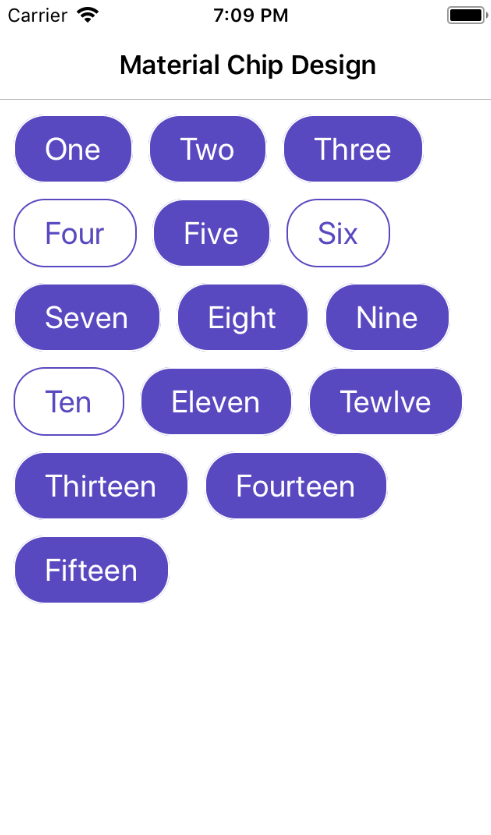

# xamarin-material-chips
This example is used to create marerial-chips design in xamarin forms MVVM. You can use and customise as per your requirement.

# Add Flowlayout Control Code
    public class FlowLayout : Layout<View>
    {
        public static BindableProperty SpacingProperty = BindableProperty.Create("Spacing", typeof(Thickness), typeof(FlowLayout), new Thickness(6));

        public Thickness Spacing
        {
            get { return (Thickness)GetValue(SpacingProperty); }
            set { SetValue(SpacingProperty, value); InvalidateLayout(); }
        }

        protected override void LayoutChildren(double x, double y, double width, double height)
        {
            var layoutInfo = new LayoutInfo(Spacing);
            layoutInfo.ProcessLayout(Children, width);

            for (int i = 0; i < layoutInfo.Bounds.Count; i++)
            {
                if (!Children[i].IsVisible)
                {
                    continue;
                }
                var bounds = layoutInfo.Bounds[i];
                bounds.Left += x;
                bounds.Top += y;
                LayoutChildIntoBoundingRegion(Children[i], bounds);
            }
        }

        protected override SizeRequest OnMeasure(double widthConstraint, double heightConstraint)
        {
            var layoutInfo = new LayoutInfo(Spacing);
            layoutInfo.ProcessLayout(Children, widthConstraint);
            return new SizeRequest(new Size(widthConstraint, layoutInfo.HeightRequest));
        }

        public class LayoutInfo
        {
            double _x = 0;
            double _y = 0;
            double _rowHeight = 0;
            Thickness _spacing;

            public LayoutInfo(Thickness spacing)
            {
                _spacing = spacing;
            }

            public List<Rectangle> Bounds { get; private set; }

            public double HeightRequest { get; private set; }

            public void ProcessLayout(IList<View> views, double widthConstraint)
            {
                Bounds = new List<Rectangle>();
                var sizes = SizeViews(views, widthConstraint);
                LayoutViews(views, sizes, widthConstraint);
            }

            private List<Rectangle> SizeViews(IList<View> views, double widthConstraint)
            {
                var sizes = new List<Rectangle>();
                foreach (var view in views)
                {
                    var sizeRequest = view.Measure(widthConstraint, double.PositiveInfinity).Request;
                    var viewWidth = sizeRequest.Width;
                    var viewHeight = sizeRequest.Height;

                    if (viewWidth > widthConstraint)
                        viewWidth = widthConstraint;

                    sizes.Add(new Rectangle(0, 0, viewWidth, viewHeight));
                }
                return sizes;
            }

            private void LayoutViews(IList<View> views, List<Rectangle> sizes, double widthConstraint)
            {
                Bounds = new List<Rectangle>();
                _x = 0d;
                _y = 0d;
                HeightRequest = 0;

                for (int i = 0; i < views.Count(); i++)
                {
                    if (!views[i].IsVisible)
                    {
                        Bounds.Add(new Rectangle(0, 0, 0, 0));
                        continue;
                    }

                    var sizeRect = sizes[i];

                    CheckNewLine(sizeRect.Width, widthConstraint);
                    UpdateRowHeight(sizeRect.Height);

                    var bound = new Rectangle(_x, _y, sizeRect.Width, sizeRect.Height);
                    Bounds.Add(bound);

                    _x += bound.Width;
                    _x += _spacing.HorizontalThickness;
                }
                HeightRequest += _rowHeight;
            }

            private void CheckNewLine(double viewWidth, double widthConstraint)
            {
                if (_x + viewWidth > widthConstraint)
                {
                    _y += _rowHeight + _spacing.VerticalThickness;
                    HeightRequest = _y;
                    _x = 0;
                    _rowHeight = 0;
                }
            }

            private void UpdateRowHeight(double viewHeight)
            {
                if (viewHeight > _rowHeight)
                    _rowHeight = viewHeight;
            }
        }
    }
   
  # Create Content Page
  Add this code in your content page
  
    <ContentPage xmlns="http://xamarin.com/schemas/2014/forms"
             xmlns:x="http://schemas.microsoft.com/winfx/2009/xaml"
             xmlns:Controls="clr-namespace:MaterialChips.Controls"
             x:Class="MaterialChips.Views.MainPage" Title="Material Chip Design">
    <ContentPage.Content>
        <ScrollView Grid.Row="0" Padding="10" HorizontalOptions="FillAndExpand" BackgroundColor="White" WidthRequest="50">
            <Controls:FlowLayout x:Name="flChipView" Spacing="5" BackgroundColor="White"/>
        </ScrollView>
    </ContentPage.Content>
</ContentPage>

# Add ViewModel 
Here, you have to add BaseViewModel and copy the code of MainPageViewModel

   public class MainPageViewModel : BaseViewModel
    {
        private List<Items> _ItemList = new List<Items>();

        public List<Items> ItemList
        {
            get { return _ItemList; }
            set { _ItemList = value; NotifyPropertyChanged("ItemList"); }
        }

        public MainPageViewModel()
        {
            ItemList = new List<Items>()
            {
                new Items{ItemName="One", IsClicked=true },
                new Items{ItemName="Two", IsClicked=true },
                new Items{ItemName="Three", IsClicked=false },
                new Items{ItemName="Four", IsClicked=true },
                new Items{ItemName="Five", IsClicked=false },
                new Items{ItemName="Six", IsClicked=true },
                new Items{ItemName="Seven", IsClicked=false },
                new Items{ItemName="Eight", IsClicked=true },
                new Items{ItemName="Nine", IsClicked=true },
                new Items{ItemName="Ten", IsClicked=true },
                new Items{ItemName="Eleven", IsClicked=false },
                new Items{ItemName="Tewlve", IsClicked=true },
                new Items{ItemName="Thirteen", IsClicked=true },
                new Items{ItemName="Fourteen", IsClicked=true },
                new Items{ItemName="Fifteen", IsClicked=false },
            };
        }
    }
    
 # Add Code in mainpage.xml.cs
    public partial class MainPage : ContentPage
    {
        #region Local Variables
        Constants.ColorConstants color = new Constants.ColorConstants();
        private ViewModels.MainPageViewModel _MainPageViewModel;
        public static List<Items> _ItemList;
        #endregion

        #region Constructor
        public MainPage()
        {
            InitializeComponent();
            BindingContext = _MainPageViewModel = new ViewModels.MainPageViewModel(); // Binding ViewModel

            On<Xamarin.Forms.PlatformConfiguration.iOS>().SetUseSafeArea(true);   // This is used to give space in iPhone X for safe Area

            _ItemList = _MainPageViewModel.ItemList;  // Binding Itemlist from Viewmodel List

            foreach (var items in _ItemList)
            {
                flChipView.Children.Add(CreateRandomBoxview(items));  // Creating a chip with one value of ItemList
            }
        }
        #endregion

        #region Functions For Create Chips
        private Frame CreateRandomBoxview(Items items)
        {
            var view = new Frame();    // Creating New View for design as chip
            view.BackgroundColor = (items.IsClicked) ? (Color)color["White"] : (Color)color["Purple"];
            view.BorderColor = (items.IsClicked) ? (Color)color["Purple"] : (Color)color["White"];
            view.Padding = new Thickness(20, 10);
            view.CornerRadius = 20;
            view.HasShadow = false;

            //Chip click event
            var tapGestureRecognizer = new TapGestureRecognizer();
            tapGestureRecognizer.Tapped += (s, e) =>
            {
                var frameSender = (Frame)s;
                var labelDemo = (Label)frameSender.Content;
                if (!items.IsClicked)
                {
                    view.BackgroundColor = (Color)color["White"];
                    labelDemo.TextColor = (Color)color["Purple"];
                    view.BorderColor = (Color)color["Purple"];
                    items.IsClicked = true;
                }
                else if (items.IsClicked)
                {
                    view.BackgroundColor = (Color)color["Purple"];
                    labelDemo.TextColor = (Color)color["White"];
                    view.BorderColor = (Color)color["White"];
                    items.IsClicked = false;
                }
            };
            view.GestureRecognizers.Add(tapGestureRecognizer);

            // creating new child that holds the value of item list and add in View
            var label = new Label();
            label.Text = items.ItemName;
            label.TextColor = (items.IsClicked) ? (Color)color["Purple"] : (Color)color["White"];
            label.HorizontalOptions = LayoutOptions.Center;
            label.VerticalOptions = LayoutOptions.Center;
            label.FontSize = 20;
            view.Content = label;
            return view;
        }
        #endregion
    }
